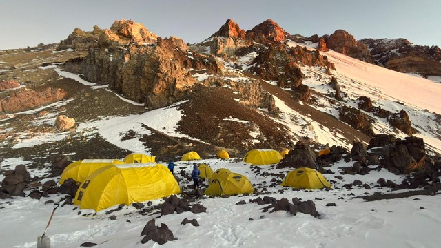
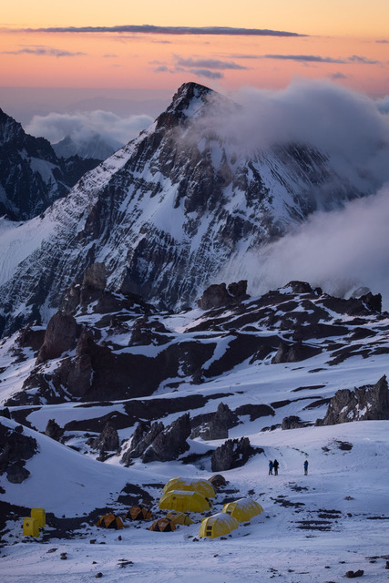
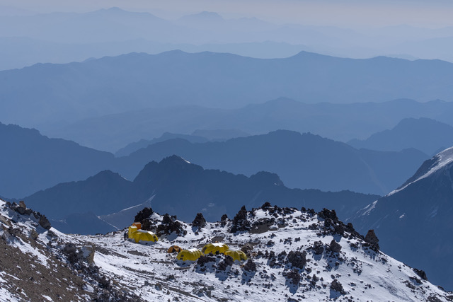

[← Cotizaciones](../README.md) · [← Inicio](../../README.md)

<!-- Last verified: 2026-09-23 -->

# Aconcagua Visión

Respondió **Sabrina Recchimuzzi** (área comercial, firma como «Oficina Plaza de Mulas») el **viernes 18 de septiembre de 2026** por email, y el **domingo 20** contestó las preguntas de seguimiento. Ofreció seguir por WhatsApp: **+54 9 2604 04-8220**. Web: [aconcaguavision.com](https://aconcaguavision.com/es/).

## ⚡ En una línea

**El permiso NO está incluido.** El domingo 20 de septiembre Sabrina se corrigió: *«el mismo NO incluye el precio del permiso, pido disculpas si me explique mal en el mail anterior»*. Con el permiso, el Básico de 4 días sale **USD 3.780 por persona**. Y como en su campamento cada noche cuenta como una pensión completa, nuestro plan de ~7 noches necesita el **Básico de 7 días: USD 3.520 + 950 = USD 4.470 por persona**, empatada con Grajales como la más cara.

## La oferta

| | |
|---|---|
| **Paquetes** | Básico (Standard) **4 días USD 2.830** · Básico **7 días USD 3.520** (este lo recomendó Sabrina para nuestro plan) |
| **Permiso** | **No incluido.** Textual (20/09): *«El precio del paquete es de U$D 2.830 - el mismo NO incluye el precio del permiso, pido disculpas si me explique mal en el mail anterior.. El monto del permiso se debe abonar aparte! Realizamos la gestión y compra del permiso pero se debe abonar de manera separada.»* |
| **Total con permiso** | 4 días **USD 3.780** · 7 días **USD 4.470** por persona |
| **Noches fuera del paquete** | **No se puede acampar y cocinar propio en su campamento:** *«si se quedan en un campamento, esa noche corre como una de las de pension completa. Es decir, no se pueden quedar en el campamento y cocinarse por su lado o quedarse en la carpa usando solo el baño»*. Pensión extra: **USD 390** por persona por noche |
| **Reparto de los días** | Libre. Los 4 días en Plaza de Mulas son posibles entrando directo, pero el guardaparque de Confluencia puede frenarlos si llegan tarde |
| **Pensión completa** | Desayuno, almuerzo, cena y merienda, más domo comedor, baños, **duchas con agua caliente, electricidad y wifi** |
| **Camas** | **No incluidas** en el paquete |
| **Mulas** | Hasta **35 kg por persona**, subida y bajada. Kilo extra: **USD 8 hasta Confluencia** y **USD 21 hasta Plaza de Mulas** (5 kg de más a Plaza de Mulas = USD 105). Los bolsos se entregan en **Puente del Inca**, en su base; todo va a Confluencia y sube a Plaza de Mulas el día que ustedes suben |
| **Altura (opcional)** | **USD 600:** uso de los campamentos de altura (comedor, cocina, gas, utensilios, baños, wifi, electricidad) y, como gesto, **les prestan carpa** (1 cada 2 personas), entregada en cada campamento desde Confluencia hasta Campo III. **USD 150:** solo el baño en los 3 campamentos de altura (sus porteadores bajan los desechos) |
| **Permiso en preventa** | **Nominado.** Necesitan el pago, nombre y apellido y número de pasaporte. Lo entregan impreso en **Puente del Inca** |
| **Seguro** | Cualquiera que cubra **evacuación en helicóptero hasta 5.500 m**. Según Sabrina, el certificado y la exención de responsabilidad se presentan antes de entrar al parque. Del American Alpine Club: *«pueden enviarme copia y ver si sirve»* |
| **Precio y seña** | El precio del paquete se mantiene **hasta el 10 de octubre**: hasta esa fecha se paga una **seña del 30 %** y el saldo hasta 20 días antes de la expedición. El permiso a USD 950 vale hasta el 30 de septiembre |
| **Pago** | En dólares a **una cuenta argentina** de Aconcagua Visión, con factura por cada pago |
| **Cancelación** | El permiso no se transfiere a otra persona, pero sí a la temporada siguiente. Lo pagado se guarda para la temporada siguiente (pagando el saldo a la tarifa nueva); con todo pagado, se reprograma a precio congelado. Con reintegro: **60 % de penalidad** si se cancela 25 días antes y **100 %** a 10 días o menos |
| **Mulas sueltas** | No: *«No contamos con servicio suelto de mulas.»* |
| **Traslados** | La web los marca como **no incluidos** en el Básico (sí en el Full) |
| **Fechas** | Último ingreso: **15 de febrero**. Las mulas trabajan *«hasta que bajemos todos»* |
| **Auto** | En la entrada del parque, donde se hace el check-in (Horcones) |

## A favor

- Contestó todo, en orden, y reconoció el error del permiso sin vueltas.
- Es la única que **presta carpa en los campamentos de altura** (con el servicio de USD 600): una carpa menos para subir desde Confluencia hasta Campo III.
- Duchas calientes, electricidad y wifi incluidos en el básico, y factura por cada pago.
- Congela el precio del paquete hasta el 10 de octubre con una seña del 30 %.
- Empresa B Corp certificada desde 2022 ([ficha B Corp](https://www.bcorporation.net/en-us/find-a-b-corp/company/aconcagua-vision-srl/)) y segunda en unidades adjudicadas en la licitación de 2026 ([Diario Mendoza](https://www.diariomendoza.com.ar/mendoza/el-gobierno-adjudico-servicios-turisticos-aconcagua-11-prestadores-n177054)).

## ⚠️ Cuidado

- **El permiso va aparte.** El «USD 2.830 con el permiso incluido» del primer email fue un error: con el permiso son USD 3.780 (4 días) o USD 4.470 (7 días).
- **No se puede acampar gratis en su campamento:** cada noche es una pensión (USD 390 la extra). Para nuestras ~7 noches hay que pagar el de 7 días.
- **Kilos extra caros:** USD 21 por kilo hasta Plaza de Mulas.
- **Sigue diciendo que el seguro se presenta antes de entrar al parque.** Con permiso **nominado** de preventa, la resolución pide la documentación antes del 30 de septiembre, y Mallku, AMG y Grajales piden la póliza ya.
- El permiso nunca se devuelve, y cancelar con reintegro cuesta el 60 % del total a 25 días.
- No tiene reseñas públicas de clientes.

## Qué se verificó por fuera

- **El email del 20/09 confirma lo que decía la web** (*«no incluye el costo del permiso»*): el «permiso incluido» del primer email era un error de Sabrina, no una oferta especial.
- Su página de logística 2026-27 dice *«Gestión integral para obtener el permiso de ascenso con descuento (no incluye el costo del permiso)»* ([es](https://aconcaguavision.com/es/logistica/en-aconcagua)) y *«permit fee not included»* ([en](https://aconcaguavision.com/logistics/in-aconcagua)). Revisado el 19/09/2026. Contradice el email.
- Ni siquiera su expedición guiada de USD 6.294 incluye el permiso ([ruta normal](https://aconcaguavision.com/es/expediciones/ruta-normal)). No publican precios de logística en la web.
- La web pide **el 50 % del paquete** para confirmar la reserva, y en el Básico los traslados no están incluidos.
- Certificada **B Corp** desde septiembre de 2022, con 93,7 puntos ([B Corp](https://www.bcorporation.net/en-us/find-a-b-corp/company/aconcagua-vision-srl/)). En la licitación de 2026 sacó el segundo mejor puntaje técnico (82,5/100) de 12 oferentes ([Decreto 1885/26](https://boe.mendoza.gov.ar/default/public/publico/verpdf/32674)).
- Unidades adjudicadas: 132 en Plaza de Mulas y 44 en Confluencia. Un guía de otra empresa la nombra entre las «Big Three» junto con Inka y Grajales ([Reddit, mar 2026](https://reddit.com/r/alpinism/comments/1rwm8i9/guiding_company_aconcagua/), testimonio).
- No tiene reseñas públicas propias (no aparece su ficha principal en Google Maps, ni TripAdvisor, ni relatos en Reddit). Conviene pedirle 1 o 2 referencias de escaladores independientes de 2025-26.
- Su exigencia de seguro (5.500 m) coincide con el mínimo oficial de la preventa. Pero para la preventa el seguro no se entrega «antes de entrar al parque»: con permiso innominado hay que mandarlo antes del **25 de octubre** ([Res. 581/2026, Anexo II](https://boe.mendoza.gov.ar/publico/verpdf/8a91a03494e4475255c9b6c8d04ae9526b7d07fa38/anexo)).
- Circulan tres teléfonos: el de la lista oficial del parque (+54 9 261 653-4405), el de su web (+54 261 650-2359, que es el mismo que publica Grajales) y el WhatsApp de Sabrina (+54 9 2604 04-8220, característica de San Rafael). Antes de transferir, confirmar los datos bancarios llamando al número oficial.

## Qué dice la gente

**No tiene reseñas públicas de clientes.** No aparece con ficha propia en Google Maps (solo «Galpón Aconcagua Vision SRL», con 1 reseña), no tiene página en TripAdvisor ni en Trustpilot, su Facebook figura como *«Not yet rated (0 Reviews)»* y no hay relatos en Reddit ni en foros. Es la única de las seis sin una sola opinión independiente verificable. Lo que hay son testimonios en su propia web y los relatos de su socio suizo.

| Dónde | Nota | Reseñas |
|---|---:|---:|
| Google Maps | sin ficha propia | 0 |
| Facebook | «Not yet rated» | 0 |
| TripAdvisor / Trustpilot / Reddit | sin presencia | 0 |

**Lo que más elogian:**

- **Kobler & Partner**, la agencia suiza que opera con ellos, describe el domo de Aconcagua Visión en el campo base como un refugio y la comida «a nivel de estrellas». Ojo: **Kari Kobler es uno de los fundadores de Aconcagua Visión**, así que no es una opinión independiente.
- Lo que sí está verificado por fuera: **certificación B Corp desde 2022** con 93,7 puntos, el segundo mejor puntaje técnico de 12 oferentes en la licitación de 2026, y 132 unidades en Plaza de Mulas.
- Un guía de una empresa competidora la menciona entre las «Big Three» junto con Inka y Grajales, en Reddit, marzo de 2026.

**Las quejas:**

- **Cero reseñas de clientes en cualquier plataforma.** No es una señal negativa, pero tampoco se puede contrastar nada de lo que prometen: ni las duchas, ni las mulas, ni cómo tratan a un cliente de paquete mínimo.
- Los testimonios de su web son material propio de la empresa.
- Conviene pedirles **dos referencias de montañistas independientes de la temporada 2025-26** antes de pagar el 50 %.

<details><summary><b>Reseñas textuales</b> (1)</summary>

> Wie ein Bergrefugium thront inmitten der Zeltdom der Bergagentur Aconcagua Vision, welche unsere Logistik am Berg organisiert. Nach dem Motto „let your self in - leave the rest to us“ werden wir von der Crew aufgenommen und kulinarisch auf Sterneniveau bewirtet.
>
> — [Kobler & Partner / Bächli Bergsport, expedición Aconcagua 360°](https://www.kobler-partner.ch/berichte/aconcagua-360/) — socio comercial, no es cliente independiente

</details>

## Mensaje para confirmar lo que falta

Ya no es una de las más baratas para nuestro plan. Si igual la eligen, esto es lo que falta confirmar. Listo para copiar y mandar por WhatsApp o email.

```text
Hola Sabrina, gracias por la respuesta tan clara! Si vamos con ustedes, sería el Básico de 7 días para los dos. Nos confirmas:
1. El total por persona: USD 3.520 del paquete + USD 950 del permiso, y la seña del 30 % hasta el 10 de octubre. El permiso lo pagamos junto con la seña antes del 30 de septiembre?
2. Para el permiso nominado, la resolución de preventa pide el seguro antes del 30 de septiembre. Les mandamos la póliza (American Alpine Club Leader) y la exención de responsabilidad ya, junto con el pago?
3. Nos confirmas por escrito que aceptan el AAC Leader si te mandamos el certificado?
4. Los datos de la cuenta para transferir en USD desde Chile. Los confirmamos por teléfono antes de mandar la plata.
Gracias!
```

## Fotos que mandó

**Campamento de Aconcagua Visión**



**Nido de Cóndores (Campamento 2)**



**Berlín (Campamento 3, Ruta Normal)**



Las otras fotos del email están en [Adjuntos](#adjuntos).

## Correspondencia completa

Texto tal como llegó, sin el historial citado. Se omitieron los datos personales de Vlad y Felipe, los datos bancarios y los links personales de pago y de formularios.

### 1. Vlad → Aconcagua Visión · jue 17 sep 2026, 19:20 (hora de Chile/Argentina)

**De:** Vlad · **Para:** office@aconcaguavision.com · **Cc:** info@aconcaguavision.com, [email de Felipe]

**Asunto:** Consulta: mulas y paquete mínimo - Ruta Normal - 2 personas - febrero 2027

> Hola, equipo de Aconcagua Visión, como estan?  
>
> Somos dos montañistas y estamos organizando el *Aconcagua por la Ruta Normal, sin guía* , para febrero de 2027: Vlad (ucraniano, residente en Chile) y Felipe (chileno). Los dos vivimos en Santiago y vamos a viajar en nuestro propio auto hasta Penitentes.  
>
> La idea es *entrar al parque el miércoles 10 de febrero de 2027* y salir alrededor del 23, dejando un par de días de margen por el clima.  
>
> Lo que necesitamos de ustedes son *sobre todo las mulas*. Llevamos nuestras propias carpas, cocina y comida, y *pensábamos cocinar por nuestra cuenta*. Vimos que su paquete de logística más económico es el *Básico Standard* , que incluye campamento base integral, mulas y gestión del permiso juntos, así que la duda es si existe algo más liviano para nuestro caso.  
>
> Las preguntas:  
>
> * *Les sirve el 10 de febrero* como fecha de ingreso? Y las mulas de regreso siguen operando a fines de febrero?  
>
> * Venden *el servicio de mulas suelto, sin pensión completa* ? Si sí, a qué precio, ida y vuelta? Calculamos unos *40 kg cada uno*.  
>
> * Si no, *cuál es el precio por persona del Básico Standard de 4 días* ?  
>
> * *Qué seguro* de rescate y evacuación nos recomiendan? Les sirve una membresía anual tipo American Alpine Club?  
>
> * Vimos que el seguro va atado a la compra del permiso, *hasta qué fecha* necesitan tenerlo en sus manos?  
>
> * Nos pueden comprar *los dos permisos de ascenso en la preventa antes del 30 de septiembre* ? Qué necesitan de nuestra parte?  
>
> * Hay *dónde dejar el auto en Penitentes* esas dos semanas?  
>
> Si pueden contestarnos *antes del 25 de septiembre* nos ayudarían un montón, porque queremos alcanzar a comprar los permisos en preventa.  
>
> Cualquier cosa nos escriben por acá, o nos dicen si prefieren seguir por WhatsApp.  
>
> Muchas gracias y saludos!  
>
> Vlad Shvets  

---

### 2. Aconcagua Visión → Vlad · vie 18 sep 2026, 11:22 (hora de Chile/Argentina)

**De:** Oficina Plaza de Mulas <sabrina@aconcaguavision.com> · **Para:** Vlad

**Asunto:** Re: Consulta: mulas y paquete mínimo - Ruta Normal - 2 personas - febrero 2027

> Hola Vlad! Un gusto! Gracias por contactarnos  
> Mi nombre es Sabrina y formo parte del departamento comercial de Aconcagua Vision.  
> El último ingreso al parque puede ser el 15 de febrero, por lo que es viable su plan de ingreso y egreso.  
> Voy a ir contestando cada punto:  
> 1- Pueden ingresar en esa fecha y las mulas continuan trabajando hasta que bajemos todos, así que no es un problema.  
> 2- El servicio de mulas viene incluido con el paquete básico que vio en la página. No contamos con servicio suelto de mulas.  
> En el paquete básico el servicio de mulas es de hasta 35 kilos.  
> 3- el Servicio básico de 4 días contempla 4 días de uso de campamento intermedio y base, es decir, 1 día Confluencia y 3 en Plaza de Mulas (siendo 2 de subida y uno de bajada). La pensión completa incluye las comidas: desayuno, almuerzo, cena y merienda, pero también incluye el uso del campamento: domo comedor, baños, duchas con agua caliente, electricidad y wifi. Además, el paquete incluye el servicio de mulas (hasta 35 kilos de subir y de bajada) y la asistencia y gestión de la compra del permiso de ingreso al parque. El costo de este paquete es de U$D 2830. El costo del permiso está incluido. Actualmente el Parque sacó a la venta los permisos con tarifa diferencial, siendo el costo del permiso para la Quebrada de Horcones de U$D950. Esta tarifa se va a mantener hasta el 30 de septiembre.  
> El paquete no incluye los campamentos de altura. En caso de que quieran sumar ese servicio (uso de comedores, cocina, gas, utensilios, baños, WIFI y electricidad) el costo extra es de U$D 600. Si sólo desean hacer uso de los baños de altura, el costo extra es de U$D 150 (en este caso nuestros porteadores son los encargados de bajar los desechos humanos a campo base)  
> 4- El seguro puede ser cualquiera siempre y cuando cubra evacuación en helicóptero hasta 5.500 metros.  
> 5- Para comprar el permiso en preventa no es necesario contar con el certificado del seguro, con datos personales y pasaporte alcanza. Antes de la fecha de ingreso al parque si o si es necesario presentar el certificado.  
> 6- Es posible realizar la compra de los permisos en preventa siempre y cuando los servicios contratados sean con nosotros.  
> 7- El auto lo pueden dejar en la entrada al parque, justo donde se realiza el check in.  
> Cualquier duda o consulta estoy a disposición.  
> Si les resulta más cómodo escribir por watts, les dejo mi número: +549 2604 048220.  
>
> Adjunto les envío fotos de nuestros campamentos para que los conozcan.  
>
> Saludos,  
>
> Sabrina.  
>
> *Los precios son por persona.  

**Adjuntos:** [WhatsApp Image 2026-03-23 at 10.27.09-9.jpeg](adjuntos/WhatsApp-Image-2026-03-23-at-10.27.09-9.jpeg) (78 KB) · [WhatsApp Image 2026-03-23 at 10.27.09-12.jpeg](adjuntos/WhatsApp-Image-2026-03-23-at-10.27.09-12.jpeg) (98 KB) · [WhatsApp Image 2026-03-23 at 10.27.09.jpeg](adjuntos/WhatsApp-Image-2026-03-23-at-10.27.09.jpeg) (103 KB) · [WhatsApp Image 2026-03-23 at 10.31.23-2.jpeg](adjuntos/WhatsApp-Image-2026-03-23-at-10.31.23-2.jpeg) (106 KB) · [WhatsApp Image 2026-03-23 at 10.31.23.jpeg](adjuntos/WhatsApp-Image-2026-03-23-at-10.31.23.jpeg) (81 KB) · [AV Camp II Nido de Condores.jpeg](adjuntos/AV-Camp-II-Nido-de-Condores.jpeg) (115 KB) · [Berlin Camp (Camp 3 Normal Route).jpeg](adjuntos/Berlin-Camp-Camp-3-Normal-Route.jpeg) (73 KB)

---

### 3. Vlad → Aconcagua Visión · sáb 19 sep 2026, 13:17 (hora de Chile/Argentina)

**De:** Vlad · **Para:** sabrina@aconcaguavision.com · **Cc:** office@aconcaguavision.com, [email de Felipe]

**Asunto:** Re: Consulta: mulas y paquete mínimo - Ruta Normal - 2 personas - febrero 2027

> Hola Sabrina, como estas?  
>
> Gracias por la respuesta tan completa y por las fotos. Queremos decidir esta semana para alcanzar la preventa, asi que te dejo las dudas concretas que nos quedan.  
>
> *1. El precio y el permiso (lo mas importante)*  
>
> * Nos confirmas por escrito que los *USD 2.830 por persona incluyen el permiso de preventa de USD 950* , o sea que no pagamos nada aparte al Parque? Te lo preguntamos porque en la pagina de ustedes dice "Gestion integral para obtener el permiso de ascenso con descuento (no incluye el costo del permiso)" , y queremos estar seguros de que estamos comparando bien.  
>
> * El precio se mantiene si terminamos de pagar despues del 30 de septiembre?  
>
> *2. Las noches que no cubre el paquete*  
>
> * Nuestro plan son *2 noches en Confluencia y unas 5 en Plaza de Mulas* , y el basico cubre 4 dias (1 + 3). Las otras noches podemos quedarnos en nuestra carpa y cocinar nosotros, usando *banos y agua* ? Tiene costo por noche?  
>
> * Se puede repartir los 4 dias distinto, por ejemplo todos 4 en Plaza de Mulas?  
>
> * La cama en el dormi de Confluencia esta incluida en el basico?  
>
> *3. Mulas*  
>
> * Llevamos *unos 40 kg cada uno* y el paquete incluye 35. Podría ser, o hay que pagar extra?  
>
> * Donde y a que hora entregamos los bolsos? Vamos en auto propio desde Santiago.  
>
> * Las mulas dejan carga en Confluencia o van directo a Plaza de Mulas?  
>
> *4. Seguro y permiso*  
>
> * Compran el permiso *nominado o innominado* ? Que necesitan de nosotros y hasta que fecha?  
>
> * Hasta cuando necesitan el certificado del seguro? Preguntamos porque para los permisos de preventa la documentacion se presenta en octubre, no antes de entrar al parque.  
>
> * Nos sirve la membresia *Leader del American Alpine Club* , que cubre rescate y evacuacion sin limite de altura? Si te mandamos el certificado, nos confirmas por escrito que la aceptan?  
>
> * Donde nos entregan el permiso impreso: Mendoza, Penitentes o Horcones?  
>
> *5. Altura, traslados y pago*  
>
> * Los *USD 600* de campamentos de altura incluyen carpa, o solo el uso de comedor, cocina, banos y wifi? Y los *USD 150* de solo banos cubren las tres noches de altura?  
>
> * Como se paga desde Chile (transferencia en USD?) y cual es la politica de cancelacion? Nos pueden emitir factura o recibo de cada pago?  
>
> Con esas respuestas decidimos. Muchas gracias!  
>
> Vlad Shvets  


---

### 4. Aconcagua Visión → Vlad · dom 20 sep 2026, 10:45 (hora de Chile/Argentina)

**De:** Oficina Plaza de Mulas <sabrina@aconcaguavision.com> · **Para:** Vlad

**Asunto:** Re: Consulta: mulas y paquete mínimo - Ruta Normal - 2 personas - febrero 2027

> Hola Vlad!  
> Me parece una muy buena idea querer aprovechar el tiempo y definirlo esta semana.  
> A continuación voy a ir contestando cada pregunta:  
> 1- El precio del paquete es de U$D 2.830 - el mismo NO incluye el precio del permiso, pido disculpas si me explique mal en el mail anterior.. El monto del permiso se debe abonar aparte! Realizamos la gestión y compra del permiso pero se debe abonar de manera separada. El precio del permiso de U$D 950 se encuentra vigente hasta el 30 de septiembre. En cuanto al paquete logsitico, el mismo se mantiene hasta el 10 de octubre. Hasta esa fecha se puede abonar una seña del 30% y el saldo abonarlo hasta 20 dias antes de la expedicion.  
> 2- Las 4 noches o pensiones completas se pueden repartir de cualquier forma, pero si se quedan en un campamento, esa noche corre como una de las de pension completa. Es decir, no se pueden quedar en el campamento y cocinarse por su lado o quedarse en la carpa usando solo el baño por ejemplo. No se venden servicios completos, sino que el tiempo de estadía en el campamento se entiende como la pensión completa. En caso de necesitar dias extras en el campamento, se debe abonar el precio de pensión completa extra de U$D 390. Si fueran a utilizar los 4 dias en Plaza de Mulas, deberian ingresar al parque e ir directamente a Plaza de Mulas, siempre teniendo en consideración que es un tramo muy largo y si para la hora en que pasan por Confluencia Guardaparques entiende que es tarde para seguir hasta Plaza de Mulas, no los van a dejar seguir. Por ello, creo que lo más conveniente sería contratar el paquete básico pero que incluye 7 pensiones completas entre Confluencia y Plaza de Mulas. El precio del de 7 días es de U$D 3.520.  
> Las camas no están incluidas en el paquete.  
> 3-La carga incluida es de 35 kilos, por kilo extra se debe abonar U$D 8 por kilo para la carga que va a Confluencia y  U$D 21 por kilo por la carga que va hasta Plaza de Mulas.  Los bolsos se entregan en Puente de Inca, donde nosotros tenemos nuestra base. Se envía todo a Confluencia y el día que mueven a Mulas, se traslada todo a Plaza de Mulas. (Probablemente puedan enviar una parte directamente a Mulas pero depende de la logistica de esos dias).  
> 4-Los permisos los compramos nominados. Para su compra es necesario el pago del mismo, nombre y apellido, y numero de pasaporte. Antes de ingresar al parque (si o si) debemos presentar al Parque una Exención de Responsabilidad y el Certificado del Seguro que cubra la evacuación en helicóptero hasta 5.500 metros. Claramente que si ya cuentan con toda la documentación, podemos presentarla una vez comprado el permiso. Respecto al certificado que tienen, pueden enviarme copia y ver si sirve. La entrega del permiso impreso será en Puente de Inca en su caso, ya que no van a ir a Mendoza!  
> 5-Los 600U$D incluyen el uso de los campamentos de altura. La carpa no está incluida pero en su caso, y a fin de tener un gesto de buena voluntad para que puedan alivianar su carga, se las incluyo. Esto significa que contratando el uso de los campamentos de altura, les incluyo la carpa toda la vuelta (1 carpa cada 2 personas). Cada carpa será entregada en cada campamento, desde confluencia hasta Campo III. Se aliviana carga de mulas, carga de porteo. Asimismo, al contar con las comidas en el base e intermedio y el gas en la altura, van a poder trasladar menos kilos y quizá realizar la expedicion más livianos y ágiles. En el caso de sólo abonar los U$D 150 - lo incluido es el uso del baño en cualquiera de los 3 campamentos de altura.  
> Los pagos deben realizarse en dólares a una cuenta argentina de Aconcagua Vision. Por cada pago se les envia la factura. En cuanto a la política de cancelación: voy a ir por puntos: a) el permiso no es transferible a otra persona pero si puede transferirse a la siguiente temporada. b) i) el porcentaje abonado se respeta y mantiene para la siguiente temporada, debiendo abonar el saldo actualizado a la tarifa de esa temporada, ii) pago total de la expedición: se reprograma la expedicion para la siguiente temporada sin actualización de precio (se congela el precio por su pago total) iii) cancelación de la expedición con reintegro: si la cancelación es 25 antes de la fecha de inicio, 60% del total de la expedicion de penalidad, si es 10 días o menos antes del comienzo de la expedición 100% de penalidad.  
>
> Espero haber podido contestar todas sus preguntas y dudas! Si surge alguna otra, por favor, no duden en escribirme!  
> Quedo a disposición,  
>
> Saludos  
> Sabrina  


## Adjuntos

| Archivo | Tamaño |
|---|---:|
| [WhatsApp Image 2026-03-23 at 10.27.09-9.jpeg](adjuntos/WhatsApp-Image-2026-03-23-at-10.27.09-9.jpeg) | 78 KB |
| [WhatsApp Image 2026-03-23 at 10.27.09-12.jpeg](adjuntos/WhatsApp-Image-2026-03-23-at-10.27.09-12.jpeg) | 98 KB |
| [WhatsApp Image 2026-03-23 at 10.27.09.jpeg](adjuntos/WhatsApp-Image-2026-03-23-at-10.27.09.jpeg) | 103 KB |
| [WhatsApp Image 2026-03-23 at 10.31.23-2.jpeg](adjuntos/WhatsApp-Image-2026-03-23-at-10.31.23-2.jpeg) | 106 KB |
| [WhatsApp Image 2026-03-23 at 10.31.23.jpeg](adjuntos/WhatsApp-Image-2026-03-23-at-10.31.23.jpeg) | 81 KB |
| [AV Camp II Nido de Condores.jpeg](adjuntos/AV-Camp-II-Nido-de-Condores.jpeg) | 115 KB |
| [Berlin Camp (Camp 3 Normal Route).jpeg](adjuntos/Berlin-Camp-Camp-3-Normal-Route.jpeg) | 73 KB |

[← Cotizaciones](../README.md) · [← Inicio](../../README.md)
