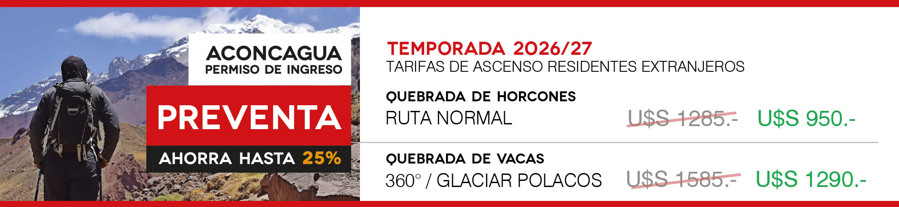

[← Cotizaciones](../README.md) · [← Inicio](../../README.md)

<!-- Last verified: 2026-09-19 -->

# Inka Expediciones

Respondió **Esperanza Lara** el **viernes 18 de septiembre de 2026** a Vlad y a Felipe, con la tabla de precios, los formularios del permiso y el folleto de su seguro. Teléfono: **+54 9 261 569-4668**. Web: [inkaexpediciones.com](https://inkaexpediciones.com/es/).

## ⚡ En una línea

**Soporte Logístico Básico de 4 días: USD 2.700 por persona (precio especial hasta el 30 de septiembre; regular USD 3.500), sin permiso.** Con el permiso de preventa son **USD 3.650 por persona**.

## La oferta

| | |
|---|---|
| **Paquetes** | **Básico** 4 días USD 2.700 / 7 días USD 3.390 · **Full** 4 días USD 3.240 / 7 días USD 3.930 · **Upgrade** 4 días USD 6.290 / 7 días USD 6.980 (precios especiales hasta el 30/09) |
| **Permiso** | **No incluido**: *«El precio publicado no incluye el permiso de ingreso al Parque y tampoco el seguro»* |
| **El Básico incluye** | Servicios esenciales, mulas 35 kg por persona, 2 noches de alojamiento solo en Confluencia, 4 pensiones completas, domo comedor, carga de celular, reporte del clima |
| **El Básico no incluye** | **Wifi y ducha caliente** (solo desde el Full), traslados, alojamiento en Plaza de Mulas |
| **Mulas** | 35 kg por persona. *«Cualquier equipaje que supere ese límite deberá ser transportado por ustedes»*: no venden kilos extra |
| **Servicios** | Solo paquetes armados: *«Lo que no podemos hacer es quitar servicios que ya están incluidos en el paquete.»* |
| **Reserva y preventa** | **Depósito de USD 150 por persona no reembolsable** (link de Stripe). Depósito y pago del permiso hasta el **25 de septiembre**; documentos hasta el **30 de septiembre** |
| **Seguro** | Evacuación en helicóptero hasta **5.000 m** + seguro de viaje según Argentina, en PDF. Recomiendan Global Rescue o su «Aconcagua Assistance» (USD 600). AAC: *«hemos recibido anteriormente montañistas con el Seguro de American Alpine Club»* |
| **Fechas** | 10 de febrero sin problema; mulas hasta principios de marzo; el permiso dura 20 días |
| **Auto** | En Penitentes *«no es recomendable»* |

## A favor

- La tabla más completa y transparente: precio regular, precio especial y fecha de vencimiento.
- Aceptan explícitamente a montañistas con el American Alpine Club.
- Inka es la empresa más grande del parque (169 unidades en Plaza de Mulas).

## ⚠️ Cuidado

- Con el permiso son USD 3.650 por persona, y el básico no trae ni wifi ni duchas.
- **Plazo más corto de todos: 25 de septiembre** para el depósito y el pago del permiso. Su plantilla además dice «antes del 10 de septiembre», que ya pasó.
- Piden el seguro a **5.000 m**, bajo el mínimo oficial de 5.500 m. Su «Aconcagua Assistance» cubre solo hasta Nido de Cóndores (5.400 m), no Cólera ni la cumbre.
- Depósito no reembolsable y permiso no reembolsable.
- No dijeron si se puede acampar y cocinar las noches fuera del paquete.

## Qué se verificó por fuera

- Su exigencia de seguro (**5.000 m**) está bajo el mínimo oficial de 5.500 m ([Res. 581/2026, Anexo II](https://boe.mendoza.gov.ar/publico/verpdf/8a91a03494e4475255c9b6c8d04ae9526b7d07fa38/anexo)).
- El «antes del 10 de septiembre» de su plantilla es de otra temporada: la preventa empezó el 14 de septiembre. Valen sus fechas del email (25 y 30 de septiembre).
- El «USD 1.285» tachado en su tabla de permisos no sale de ninguna norma: el precio normal 2026-27 todavía no se publica. El USD 950 sí es oficial.
- Empresa más grande del parque: 169 unidades en Plaza de Mulas y 52 en Confluencia. Google Maps: 4,4 con 159 reseñas; TripAdvisor 4,3 con 28. Es la mejor documentada con escaladores independientes (agua, baños, ayuda con el clima) ([Brooke Beyond](https://brookebeyond.com/solo-climbing-aconcagua), testimonio con links de afiliado).

## Mensaje para confirmar lo que falta

Listo para copiar y mandar por WhatsApp o email.

```text
Hola Esperanza, muchas gracias por la info! Algunas preguntas:
1. Los precios de la tabla son por persona?
2. Nuestro plan tiene 2 noches en Confluencia y unas 5 en Plaza de Mulas. Las noches fuera de las 4 pensiones podemos estar en nuestra carpa y cocinar nosotros, usando los baños? Tiene costo?
3. El depósito de USD 150 se descuenta del precio del paquete?
4. La fecha límite es el 25 de septiembre (la plantilla dice 10 de septiembre)?
5. Aceptan la carta de membresía del American Alpine Club como seguro de evacuación esta temporada?
```

## Correspondencia completa

Texto tal como llegó, sin el historial citado. Se omitieron los datos personales de Vlad y Felipe, los datos bancarios y los links personales de pago y de formularios.

### 1. Vlad → Inka Expediciones · jue 17 sep 2026, 19:21 (hora de Chile/Argentina)

**De:** Vlad · **Para:** inka@inka.com.ar · **Cc:** [email de Felipe]

**Asunto:** Consulta: mulas y paquete mínimo - Ruta Normal - 2 personas - febrero 2027

> Hola, equipo de Inka, como estan?  
>
> Somos dos montañistas y estamos organizando el *Aconcagua por la Ruta Normal, sin guía* , para febrero de 2027: Vlad (ucraniano, residente en Chile) y Felipe (chileno). Los dos vivimos en Santiago y vamos a viajar en nuestro propio auto hasta Penitentes.  
>
> La idea es *entrar al parque el miércoles 10 de febrero de 2027* y salir alrededor del 23, dejando un par de días de margen por el clima.  
>
> Lo que necesitamos de ustedes son *sobre todo las mulas*. Llevamos nuestras propias carpas, cocina y comida, y *pensábamos cocinar por nuestra cuenta* , así que buscamos el *paquete más básico* que tengan y que igual califique como permiso *"con asistencia"*. Vimos que sus servicios logísticos básicos incluyen mulas de hasta 35 kg por persona y hasta 7 pensiones completas en campo base, y la duda es si *se puede tomar sin las comidas*.  
>
> Las preguntas:  
>
> * *Les sirve el 10 de febrero* como fecha de ingreso? Y las mulas de regreso siguen operando a fines de febrero?  
>
> * Nos pueden cotizar *el porte en mulas por separado* , ida y vuelta? *Cuánto cuesta cada kilo o mula extra sobre los 35 kg* ? Calculamos unos *40 kg cada uno*.  
>
> * Si no venden las mulas sueltas, *cuál es el precio por persona del paquete básico* ? Hay alguna *versión sin pensión completa* , o la más corta posible?  
>
> * *Qué seguro* de rescate y evacuación nos recomiendan? Les sirve una membresía anual tipo American Alpine Club?  
>
> * *Hasta qué fecha* necesitan tener el seguro en sus manos?  
>
> * Nos pueden comprar *los dos permisos de ascenso en la preventa antes del 30 de septiembre* ? Qué necesitan de nuestra parte?  
>
> * Hay *dónde dejar el auto en Penitentes* esas dos semanas?  
>
> Si pueden contestarnos *antes del 25 de septiembre* nos ayudarían un montón, porque queremos alcanzar a comprar los permisos en preventa.  
>
> Cualquier cosa nos escriben por acá, o nos dicen si prefieren seguir por WhatsApp.  
>
> Muchas gracias y saludos!  
>
> Vlad Shvets  

---

### 2. Inka Expediciones → Vlad · vie 18 sep 2026, 11:35 (hora de Chile/Argentina)

**De:** Inka Expediciones <inka@inka.com.ar> · **Para:** Vlad

**Asunto:** Re: Consulta: mulas y paquete mínimo - Ruta Normal - 2 personas - febrero 2027

> Hola Vlad y Felipe,  
>
> Espero que se encuentren muy bien.  
>
> Mi nombre es Esperanza y va a ser un gusto asistirlos con la planificación  
> de su expedición al Cerro Aconcagua.  
>
> En este mail van a encontrar  información sobre nuestros paquetes de apoyo  
> logístico, diseñados para montañistas que desean realizar un *ascenso de  
> forma independiente*, contando al mismo tiempo con un servicio logístico  
> completo y confiable.  
>
> *Esta temporada, nuestros servicios logísticos se ofrecen únicamente en  
> paquetes ya armados, por lo que no ofrecemos servicios individuales o por  
> separado.  **De todas maneras, si lo deseas, podemos agregar servicios  
> adicionales a cualquiera de los paquetes. Lo que no podemos hacer es quitar  
> servicios que ya están incluidos en el paquete.*  
>
> Respondiendo a tus preguntas:  
>
>    - *¿Les sirve el 10 de febrero como fecha de ingreso? Y las mulas de  
>    regreso siguen operando a fines de febrero?*  
>
> Si, pueden ingresar al parque en esa fecha sin problemas, el permiso les  
> permite permanecer en el parque hasta 20 dias. Las mulas operan hasta  
> principios de Marzo, así que no habría problema con sus fechas.  
>
>    - *Nos pueden cotizar el porte en mulas por separado, ida y  
>    vuelta? ¿Cuánto cuesta cada kilo o mula extra sobre los 35 kg? Calculamos  
>    unos 40 kg cada uno.*  
>
> No ofrecemos servicios individuales o por separado. En cuanto al equipaje,  
> el peso que transportan las mulas, tanto en nuestros paquetes logísticos  
> como en nuestras expediciones programadas, es de hasta 35 kg por persona.  
> Cualquier equipaje que supere ese límite deberá ser transportado por  
> ustedes.  
>
>    - *Si no venden las mulas sueltas, cuál es el precio por persona del  
>    paquete básico? Hay alguna versión sin pensión completa, o la más corta  
>    posible?*  
>
> Les dejo abajo los valores y servicios incluidos.  
>
>    - *¿Qué seguro de rescate y evacuación nos recomiendan? ¿Les sirve una  
>    membresía anual tipo American Alpine Club?*  
>
> Si, hemos recibido anteriormente montañistas con el Seguro de American  
> Alpine Club! *Global Rescue*  
> <https://partner.globalrescue.com/inkaexpediciones/index.html> y  
> Aconcagua Assistance (vean el archivo adjunto) también brindan la cobertura  
> necesaria.  
>
>    - *¿Nos pueden comprar los dos permisos de ascenso en la preventa antes  
>    del 30 de septiembre? ¿Qué necesitan de nuestra parte? ¿Hasta qué  
>    fecha necesitan tener el seguro en sus manos?*  
>
> Por supuesto. 😊 Como únicamente podemos gestionar los permisos para  
> nuestros clientes, es necesario realizar un depósito no reembolsable de  *USD  
> 150 [link de pago de Stripe omitido] *por persona para confirmar  
> y reservar el servicio.  
>
> Una vez que recibamos el depósito, podrán enviarnos la documentación y  
> realizar el pago correspondiente para que podamos comenzar con el proceso  
> del permiso. Esto incluye también la documentación del seguro requerido.  
>
> La fecha límite para realizar el depósito y el pago del permiso es el *25  
> de septiembre de 2026*. En cuanto a la documentación, podemos recibirla  
> hasta el *30 de septiembre de 2026* como fecha límite.  
>
> Una vez que tengamos todo lo necesario, podremos avanzar con la gestión del  
> permiso. 😊  
>
>    - *¿Hay dónde dejar el auto en Penitentes esas dos semanas?*  
>
> No es recomendable, pero si, hay lugar donde dejar el auto, no sabría  
> decirte si es un lugar cubierto. Tengan en cuenta que es un pueblo de  
> montaña.  
>
> --------------------------------------------------------------------------------------------------------------------------------------------------------------------------------------------------------------------------------------------------------------------------------------  
>
> Para facilitar la planificación de tu expedición, también hemos incluido  
> información sobre los itinerarios recomendados para ascender el Aconcagua.  
> Ruta Normal - 18 días  
> <https://inkaexpediciones.com/es/expediciones-al-aconcagua/aconcagua-ruta-normal/>  
> Ruta Normal Extendida - 20 días  
> <https://inkaexpediciones.com/es/expediciones-al-aconcagua/aconcagua-ruta-normal-extendida/#gallery>  
> Ruta 360° - 19 días  
> <https://inkaexpediciones.com/es/expediciones-al-aconcagua/aconcagua-travesia-360/#aboutm>  
>
> Para una *expedición sin guía* y una experiencia más independiente,  
> ofrecemos paquetes que incluyen todo lo necesario para llegar al Campo Base  
> de manera segura y eficiente.  
>
> SOPORTE LOGÍSTICO  
> BÁSICO  
> FULL  
> UPGRADE  
> PERMISO DE INGRESO AL PARQUE X X X  
> SERVICIOS ESENCIALES ✔ ✔ ✔  
> TRASLADOS EN VEHÍCULO  
> Aeropuerto - hotel en Mendoza X ✔ ✔  
> Hotel en Mendoza - Aeropuerto X X X  
> Mendoza - Puente del Inca X ✔ ✔  
> Puente del Inca - Mendoza X ✔ ✔  
> ALOJAMIENTO EN MENDOZA X 3 estrellas, habitación compartida 5 estrellas,  
> habitación single  
> ALOJAMIENTO EN PUENTE DEL INCA X ✔ ✔  
> TRASLADOS DE CARGAS EN MULAS (35 kg por persona) ✔ ✔ ✔  
> ALOJAMIENTOS EN CAMPAMENTOS BASE 2 noches solo en Confluencia 2 noches solo  
> en Confluencia ✔  
> COMIDAS EN CAMPAMENTOS BASE 4 pensiones completas / 7 pensiones completas  
> SERVICIOS EN CAMPAMENTOS BASE  
> Uso de domo comedor ✔ ✔ ✔  
> Carga teléfono de teléfono celular ✔ ✔ ✔  
> Wifi X ✔ ✔  
> Ducha caliente X ✔ ✔  
>
> ALOJAMIENTO Y COMIDA EN ALTURA  
> X X X  
>
> SERVICIOS EN CAMPAMENTOS DE ALTURA  
> Uso de domo comedor X X ✔  
> uso de baños X X ✔  
> Wifi X ✔ ✔  
> Reporte del clima ✔ ✔ ✔  
> PORTEO DE CARGA PERSONAL (10 kg por persona) X X ✔  
> ARMADO Y DESARMADO DE TIENDA EN ALTURA X X ✔  
>
> *➡️ VALORES*  
>
> A continuación vas a poder encontrar nuestras tarifas para las distintas  
> opciones de servicio (Básico, Full y Upgrade).  
>
> *Cada paquete está disponible en dos alternativas, según la cantidad total  
> de días de pensión completa* (desayuno, almuerzo o vianda y cena) que  
> necesites:  
>
>    - 4 días de pensión completa  
>    - 7 días de pensión completa  
>
> Esto te permite elegir la opción que mejor se adapte a tu cronograma de  
> ascenso.  
> PRECIOS  
> BÁSICO FULL UPGRADE  
> 4 DÍAS 7 DÍAS 4 DÍAS 7 DÍAS 4 DÍAS 7 DÍAS  
> Precio Regular USD 3500 USD 4190 USD 4110 USD 4800 USD 7920 USD 7980  
> *Precio especial *(*) *USD 2700* *USD 3390* *USD 3240* *USD 3930* *USD  
> 6290* *USD  
> 6980*  
>
> *(*) El precio especial es válido hasta el 30 de septiembre*  
>
> *(*) El precio publicado no incluye el permiso de ingreso al Parque y  
> tampoco el seguro que cubre evacuación en helicóptero ( obligatorio)*  
> INFORMACIÓN IMPORTANTE  
> *PERMISO DE INGRESO AL PARQUE ACONCAGUA *  
>
> Para ingresar al Parque Aconcagua, es obligatorio obtener un permiso.  
>
> El permiso es *personal, intransferible y no reembolsable*.  
>
> * El costo varía según la *nacionalidad del visitante* y la *ruta  
> seleccionada*.  
> * Existe un *descuento* si reservas servicios a través de una agencia  
> autorizada.  
> * El permiso *no está incluido* en los precios de nuestras expediciones, ya  
> que es un requisito del gobierno. Sin embargo, asistimos a nuestros  
> clientes en el proceso de obtención.  
> *Tarifas de Preventa para Residentes Extranjeros:*  
>   
>
> *Documentación y pasos para obtener el permiso:*  
>
>    1. *Completar el formulario de datos personales:* Ver enlace al final  
>    del mail.  
>    2. *Enviarnos una copia de tu pasaporte* (página con los datos  
>    personales).  
>    3. *Completar y firmar la declaración jurada* (adjunta a este correo) y  
>    enviárnosla.  
>    ⚠️ *Importante:* Imprimí el documento, firmalo de puño y letra, sacale  
>    una foto o escanealo y envialo.  
>    *No se aceptan firmas digitales.*  
>    4. *Completar el formulario de exención de responsabilidad* (también  
>    adjunto a este correo).  
>    5.  
>
>    *Enviarnos el comprobante de tu seguro de evacuación y de asistencia al  
>    viajero.*  
>
>    El *seguro de evacuación* debe cubrir el rescate en helicóptero hasta  
>    los *5.000 metros*.  
>
>    El *seguro de viaje*, de acuerdo con los requisitos del Gobierno  
>    Argentino, debe incluir:  
>    - Gastos médicos y hospitalarios.  
>       - Cobertura por accidentes y enfermedades.  
>       - Asistencia de emergencia las 24 horas.  
>       - Evacuación médica o repatriación.  
>
>    Necesitamos el documento en *PDF* donde se detallen claramente todas las  
>    coberturas.  
>    6.  
>
>    *Realizar el pago del permiso por persona (antes del 10 de Septiembre de  
>    2026).*  
>
>    ⚠️ Si el pago no se realiza antes de esa fecha, no podremos emitir el  
>    permiso con la tarifa especial de preventa.  
>
>    ❗ Los pagos de los permisos *no son reembolsables*.  
>
>    Respecto al pago del permiso, puede realizarse mediante transferencia  
>    bancaria. A continuación, encontrarás los datos:  
>
>    *DATOS BANCARIOS*  
>
>    BANK NAME: Macro S.A. Buenos Aires, Argentina  
>    ACCOUNT NAME: ACONCAGUA EXPEDICIONES S.A.  
>    BENEFICIARY ADDRESS: [omitido]  
>    SWIFT CODE: [omitido]  
>    ACCOUNT NUMBER: [omitido]  
>
>    ⚠️ Una vez realizada la transferencia, por favor envianos el comprobante  
>    de pago.  
>
>    *Importante:* El cliente será responsable de todos los costos asociados  
>    a la transferencia bancaria.  
>    7. *Una vez completados los pasos 1 al 6*, te enviaremos un formulario  
>    final para que lo firmes.  
>    8. *Nosotros realizaremos el trámite ante la oficina de permisos* y,  
>    cuando nos visites en Mendoza, te entregaremos el permiso definitivo para  
>    ingresar al Parque Provincial Aconcagua.  
>
> *  ¿CÓMO RESERVAR TU LUGAR EN NUESTRAS EXPEDICIONES?          **Para  
> asegurar tu lugar, por favor sigue estos pasos:*  
>
> 1️⃣ Selecciona tu fecha de salida y ruta preferida para tu Expedición al  
> Aconcagua.  
>
> 2️⃣ Realiza un *depósito no reembolsable* de *USD 150  
> [link de pago de Stripe omitido] *por persona  
>
> Para *argentinos* preguntar modos de pagos.  
>
> 3️⃣ Completa el formulario de reserva a continuación haciendo clic en tu  
> nombre:  
>
> 👤 *VLAD  
> [link personal al formulario de permiso, omitido]*  
> (*Haz clic para completar el formulario*)  
>
> 👤 *FELIPE  
> [link personal al formulario de permiso, omitido]*  
>   (*Haz clic para completar el formulario*)  
>
> 🔹 *Una vez que completes estos pasos, recibirás un correo de confirmación* con  
> los detalles de tu viaje.  
>
> Luego, te solicitaremos la documentación necesaria para tramitar tu permiso  
> de ingreso al parque y te brindaremos las opciones de pago para cancelar el  
> saldo restante de la expedición.  
>
> 📌 *Asegúrate de revisar nuestros términos y condiciones.  
> <https://inkaexpediciones.com/es/terminos-y-condiciones/>*  
>
> Si tienes alguna pregunta o necesitas asistencia, *no dudes en contactarnos  
> en cualquier momento*.  
>
> *Saludos desde Mendoza!*  
>
> Esperanza Lara  
> *Asistente Personal de tu Aventura*  
> t: +54 0261 4250871  
> m: +54-9 261-5694668  
>
> Juan B Justo 345, Mendoza  
> 5500, Mendoza - Argentina  
> e: inka@inka.com.ar  
> *www.inka.com.ar <https://www.inkaexpediciones.com/>*  
> <https://www.instagram.com/inka_expediciones/>  
> <https://www.facebook.com/expedicionesalaconcagua/>  
> <https://www.youtube.com/user/inkaexpediciones>  
> _______________________________  
>
> *¿Quieres que conversemos?¡Podemos coordinar una llamada!*  
> 🗓️  
> *AGENDAR UNA REUNIÓN AQUÍ  
> <https://calendly.com/inka-expediciones/30min>_________________________________________*  
> *POR QUÉ ELEGIR INKA?*  
> - Compañía Local especializada en Aconcagua.  
> - Agencia autorizada para la prestación de servicios en Parque Aconcagua.  
> - Guías profesionales de montaña.  
> - Casi 30 años de trayectoria y experiencia en la montaña.  
> - Atención personalizada.  
> - Más de 40 salidas programadas, 100% garantizadas.  
> - La mejor infraestructura en los Campamentos Base.  
> - Somos dueños de nuestras mulas y de todos los servicios provistos en  
> Aconcagua.  
> - El mayor porcentaje de éxito de cumbre y satisfacción garantizada.  
> *LEER MÁS*  
> <https://inkaexpediciones.com/es/sobre-inka/10-razones-para-elegir-inka/>  

**Adjuntos:** [unnamed(1).jpg](adjuntos/tarifas-preventa-permisos-2026-27.jpg) (136 KB) · [ACONCAGUA ASSISTANCE_ESP_NOGUIADA.pdf](adjuntos/ACONCAGUA-ASSISTANCE_ESP_NOGUIADA.pdf) (136 KB) · [DESLINDE DE RESPONSABILIDAD ACONCAGUA (1).pdf](adjuntos/DESLINDE-DE-RESPONSABILIDAD-ACONCAGUA.pdf) (70 KB) · [Aconcagua-Declacion-Jurada-Aceptacion-de-Riesgo.pdf](adjuntos/Aconcagua-Declacion-Jurada-Aceptacion-de-Riesgo.pdf) (286 KB)

## Adjuntos

| Archivo | Tamaño |
|---|---:|
| [unnamed(1).jpg](adjuntos/tarifas-preventa-permisos-2026-27.jpg) | 136 KB |
| [ACONCAGUA ASSISTANCE_ESP_NOGUIADA.pdf](adjuntos/ACONCAGUA-ASSISTANCE_ESP_NOGUIADA.pdf) | 136 KB |
| [DESLINDE DE RESPONSABILIDAD ACONCAGUA (1).pdf](adjuntos/DESLINDE-DE-RESPONSABILIDAD-ACONCAGUA.pdf) | 70 KB |
| [Aconcagua-Declacion-Jurada-Aceptacion-de-Riesgo.pdf](adjuntos/Aconcagua-Declacion-Jurada-Aceptacion-de-Riesgo.pdf) | 286 KB |

[← Cotizaciones](../README.md) · [← Inicio](../../README.md)
