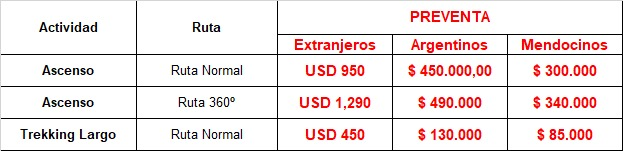

[← Cotizaciones](../README.md) · [← Inicio](../../README.md)

<!-- Last verified: 2026-09-23 -->

# Lanko Altas Montañas

Respondió **Valentina Diaz** el **viernes 18 de septiembre de 2026** con dos emails: la cotización y el procedimiento de la preventa. El **domingo 20** contestó el seguimiento y propuso el **Básico Estándar** de 7 días. WhatsApp: **+54 9 261 591 4199**. Web: [lanko.com.ar](https://www.lanko.com.ar/es).

## ⚡ En una línea

**Para nuestro plan, Lanko propone el Básico Estándar: 2 pensiones en Confluencia + 5 en Plaza de Mulas, USD 3.390 con 10 % de descuento = USD 3.051 por persona. Con el permiso: USD 4.001.** Es el que calza exacto con el itinerario, sube **40 kg sin costo extra**, trae todas las comidas e incluye **domo para dormir** en Plaza de Mulas. El Básico Corto de 4 días (USD 3.380 con el permiso) no cubre las 7 noches.

## La oferta

| | |
|---|---|
| **Paquetes** | **Básico Estándar** (7 días) USD 3.390, con 10 % de descuento **USD 3.051** · Básico Corto (4 días) USD 2.700, con descuento **USD 2.430** |
| **Permiso** | **No incluido**: *«Costo de permiso de Ingreso para realizar Ascenso»* va en «servicios no incluidos en ningún programa» |
| **Total con permiso** | Estándar **USD 4.001** · Corto USD 3.380 por persona |
| **El Estándar incluye** | Asistencia con el permiso, **traslado Penitentes ↔ Horcones**, mulas, **2 días de pensión completa en Confluencia** (con alojamiento en carpa) y **5 en Plaza de Mulas** (con **alojamiento en domo**), domos comedor, domo depósito, baños, radio entre campamentos, pronóstico, energía solar para cargar, menú vegetariano o sin TACC con aviso |
| **Reparto de los días** | Libre: *«usar pensiones de Plaza de Mulas en Confluencia o viceversa»* |
| **Mulas** | 35 kg por persona, pero **les extienden a 40 kg sin costo**: *«No deberán abonar un adicional por esto.»* Van **directo a Plaza de Mulas**; a Confluencia solo la mochila y el saco. Base de carga: **Penitentes** |
| **Wifi** | No incluido: **USD 100** por toda la estadía, en Confluencia y Plaza de Mulas |
| **Duchas** | No incluidas: **USD 30** cada una o **USD 50** el pack de 3 |
| **Seguro** | Evacuación y rescate a **6.000 m**. De la membresía del AAC: pedir *«una nota firmada donde se certifique la cobertura»* |
| **Permiso** | Se retira en su oficina de **Mendoza**; con aviso previo se lo suben a **Penitentes** |
| **Preventa** | Documentos hasta el **28 de septiembre**: formulario de reserva, deslinde firmado, pasaporte. Pago del permiso por transferencia + **seña del 10 % del paquete** + **USD 17 por transferencia** |
| **Pago** | Datos bancarios e invoice una vez confirmados los servicios |
| **Cancelación** | La seña del 10 % no se devuelve; queda como crédito para la temporada siguiente, como máximo |
| **Fechas** | Ingreso *«usualmente»* hasta el 15 de febrero (fechas 2026-27 no anunciadas). Mulas hasta la primera semana de marzo |
| **Auto** | Estacionamiento de Penitentes o de la entrada de Horcones |

## A favor

- **Calza exacto con el plan:** 2 noches en Confluencia y 5 en Plaza de Mulas, con todas las comidas.
- **40 kg de mula sin costo extra**, y con todas las comidas incluidas bajan ~6,5 kg de comida por persona.
- Domo para dormir en Plaza de Mulas y traslado Penitentes ↔ Horcones incluidos.
- Descuento del 10 % ofrecido sin pedirlo, y respondieron todo por escrito.
- Lanko tiene 148 unidades en Plaza de Mulas: es una de las empresas grandes del parque.

## ⚠️ Cuidado

- **USD 4.001 por persona con el permiso:** ~USD 200 más que Mallku (que cubre las mismas noches cocinando propio) y ~USD 1.450 más que Pared Sur.
- **Sin wifi ni duchas:** +USD 100 de wifi y USD 30-50 de duchas.
- **El permiso se retira en Mendoza**, salvo que avisen para que lo suban a Penitentes.
- No dijeron si el permiso es **nominado o innominado**, y ahora piden seguro a **6.000 m** (antes dijeron 5.400).
- La seña no se devuelve, y el descuento no tiene fecha escrita.
- Respondieron desde una cuenta de Gmail y todavía no mandaron datos bancarios: confirmarlos por teléfono al número oficial antes de transferir.

## Qué se verificó por fuera

- Su tabla de preventa (USD 950 extranjeros / ARS 450.000 argentinos / ARS 300.000 mendocinos) es exactamente la oficial ([Res. 581/2026, art. 4](https://boe.mendoza.gov.ar/default/public/publico/verpdf/32678)). **No hay tarifa latinoamericana en la preventa**: Felipe paga USD 950 igual que Vlad.
- Su frase sobre el 15 de febrero es la más precisa de todas: la fecha de ingreso de un permiso de preventa es tentativa y las fechas 2026-27 todavía no salen (Res. 581/2026, art. 9).
- El «5.400 m» del primer email está bajo el mínimo oficial (5.500 m). El «6.000 m» del segundo es una regla propia de la empresa, que el decreto permite porque si el seguro no paga la evacuación, paga la empresa.
- Unidades: 148 en Plaza de Mulas y 33 en Confluencia, y domos en Nido de Cóndores. Google Maps: 4,5 estrellas. Un equipo sin guía escribió en enero de 2026 que Lanko fue *«superb»* ([Reddit](https://reddit.com/r/Mountaineering/comments/1qefrr7/my_aconcagua_experience_5_days_up_to_6400m/), testimonio).

## Qué dice la gente

**4.54 de 5 en Google, con 97 reseñas** (2016-2026). No tiene página en TripAdvisor ni en Trustpilot, pero es la empresa con más relatos de montañistas independientes: hay reportes de equipos sin guía en cuatro idiomas, de 2015 a 2026, y todos terminan bien.

| Dónde | Nota | Reseñas |
|---|---:|---:|
| Google Maps | 4.54 | 97 |
| TripAdvisor / Trustpilot | sin ficha | 0 |

**Lo que más elogian:**

- **Es la más elegida por los que suben sin guía.** Un padre y su hijo que hicieron la Ruta Normal solos en enero de 2026 escribieron que Lanko fue *«superb»*, y se refugiaron en un domo de Lanko en Nido de Cóndores cuando el guardaparque cerró la montaña.
- **Un club argentino sin guía, en 2022, pagó USD 440 por una mula de 60 kg ida y vuelta** y con eso tuvo lugar para acampar, agua, baños y domos comunitarios para cocinar. Es la respuesta más clara que encontramos a la pregunta de las noches sin pensión.
- **Con el servicio básico dan domo comedor, agua caliente y pronóstico** en Plaza de Mulas, según una reseña de diciembre de 2023.
- Un cliente de febrero de 2024 usó **solo mulas y ayuda con el permiso**, dos temporadas seguidas, y los recomienda igual.
- El refugio Cruz de Caña en Penitentes y el equipo de Confluencia aparecen elogiados por nombre desde hace veinte años.

**Las quejas:**

- **En Plaza de Mulas el servicio baja.** Un cliente de diciembre de 2023 separa: 5 estrellas para Confluencia, y en Plaza de Mulas *«los chicos tienen buena intención pero pocos recursos y experiencia»*. Un equipo polaco sin guía dijo lo mismo y agregó que ahí Inka y Grajales se veían mejor. Nosotros vamos a dormir cinco noches justo ahí.
- **Las mulas de bajada son el punto flojo para los que no van con guía**, según un relato en SummitPost: nunca se sabe cuántas mulas llegan y a los independientes los ponen últimos en la fila. Ese cliente perdió un día esperando en el campo base. Hay que dejar por escrito que las mulas son ida y vuelta.
- **Un problema con el cambio de moneda en la oficina** de Mendoza, en febrero de 2020: cobraron en dólares y quisieron dar el vuelto al cambio oficial.
- Nadie confirma las duchas: es una promesa de la web, no aparece en ninguna reseña independiente.

<details><summary><b>Reseñas textuales</b> (7)</summary>

> We solo-ed the normal route with light logistics help from Lanko, who were superb.
>
> — u/inexdesain, enero de 2026, [Reddit](https://reddit.com/r/Mountaineering/comments/1qefrr7/my_aconcagua_experience_5_days_up_to_6400m/) — sin guía, Ruta Normal

> Nosotros contratamos a la Empresa LANKO, el servicio de una Mula con una carga de 60 kilos a un valor de 440 Dólares (subida y bajada) hasta Plaza de Mulas y tenías acceso a un lugar para acampar, al agua, baños y domos comunitarios para poder estar allí y cocinar
>
> — Asociación Argentina de Montaña, expedición del 27 de enero al 10 de febrero de 2022, [relato](https://aamtuc.org/2022/03/04/cumbre-en-el-aconcagua-por-la-ruta-normal-quebrada-de-los-horcones-expedicion-desde-el-27-de-enero-al-10-de-febrero-de-2022/) — club sin guía, carpa y cocina propias

> Hay que separar. Calificó con 5 estrellas la calidad humana, sobre todo de Maca y Facu en Confluencia. En plaza de Mulas los chicos tiene buena intención pero pocos recursos y experiencia a excepción de un par que claramente son los que manejan todo. El servicio de mulas es excelente. En Plaza de mulas te ofrecen con el servicio básico un domo comedor, agua caliente y pronostico, el domo está en pésimo estado, agua caliente aveces, y pronostico tenes que andar mendigándolo.
>
> — Astor, 2023-12-17, Google (3★)

> I used the help of the LANKO agency for the second time to reach the Aconcagua peak. This time it worked. I am very satisfied with their help. The team was always nice and smiling, open to people, although I only used mules and help in obtaining a permit. I recommend them to everyone as an agency that will help you fulfill your dreams. THANK YOU Daniel
>
> — Daniel, 2024-02-08, Google (5★)

> Incredibly capable and friendly crew, from the office to active staff on the mountain. Great prices and they make you feel at home and like family whether you're an unguided climber or purchasing a full guided package.
>
> — Simone, 2017-12-26, Google (5★)

> Check with your logistics company about mules back down. Seemed like they are never really sure how many mules are coming that next day so you may or may not get your stuff on a mule. I waited an extra day at basecamp.
>
> — coloradoclimber123, enero de 2018, [SummitPost](https://www.summitpost.org/aconcagua-inc/1029721) — solo, sin guía

> Particularmente tuvimos una mala experiencia, en la oficina de la calle Espejo donde contratamos el servicio de porteo con mulas nos cobraron en dólares y al momento de darnos el vuelto mencionaron que no tenían cambio en esa moneda y que nos darían el vuelto a precio de dolar oficial. En caso de abonar en pesos nos querían cobrar a precio de dolar con el recargo del 30 %, (muy conveniente para ellos siempre!
>
> — Valeria, 2020-02-19, Google (1★)

</details>

## Mensaje para confirmar lo que falta

Listo para copiar y mandar por WhatsApp o email, si la eligen.

```text
Hola Valentina, muchas gracias por la respuesta tan completa! El Básico Estándar nos calza justo. Antes de reservar:
1. Nos confirmas el total: USD 3.051 por persona (USD 3.390 con el 10 %) más el permiso de USD 950, y que los 40 kg por persona quedan sin costo?
2. El permiso es nominado o innominado? Para retirarlo en Penitentes, con cuánto aviso?
3. Tenemos el American Alpine Club Leader (rescate sin límite de altura). Con la nota firmada de cobertura del club alcanza, o piden algo más?
4. Nos mandan los datos bancarios completos (banco, país, moneda) y el invoice? Los confirmamos por teléfono antes de transferir.
Gracias!
```

## Correspondencia completa

Texto tal como llegó, sin el historial citado. Se omitieron los datos personales de Vlad y Felipe, los datos bancarios y los links personales de pago y de formularios.

### 1. Vlad → Lanko Altas Montañas · jue 17 sep 2026, 19:19 (hora de Chile/Argentina)

**De:** Vlad · **Para:** contacto@lanko.com.ar · **Cc:** info@lanko.com.ar, [email de Felipe]

**Asunto:** Consulta: mulas y paquete mínimo - Ruta Normal - 2 personas - febrero 2027

> Hola, equipo de Lanko, como estan?  
>
> Somos dos montañistas y estamos organizando el *Aconcagua por la Ruta Normal, sin guía* , para febrero de 2027: Vlad (ucraniano, residente en Chile) y Felipe (chileno). Los dos vivimos en Santiago y vamos a viajar en nuestro propio auto hasta Penitentes.  
>
> La idea es *entrar al parque el miércoles 10 de febrero de 2027* y salir alrededor del 23, dejando un par de días de margen por el clima.  
>
> Lo que necesitamos de ustedes son *sobre todo las mulas*. Llevamos nuestras propias carpas, cocina y comida, y *pensábamos cocinar por nuestra cuenta* , así que buscamos el *paquete más básico* que tengan y que igual califique como permiso *"con asistencia"*. Vimos el Valle de Horcones, con la versión corta de 4 días de pensión completa en lugar de 7, pero como cocinamos nosotros nos interesaría saber si *se puede cotizar solo el transporte en mulas Penitentes - Plaza de Mulas*.  
>
> Las preguntas:  
>
> * *Les sirve el 10 de febrero* como fecha de ingreso? Y las mulas de regreso siguen operando a fines de febrero?  
>
> * Nos pueden cotizar *el porte en mulas por separado* , ida y vuelta? *Cuántos kilos entran por mula* y cuánto cuesta cada mula extra? Calculamos unos *40 kg cada uno*.  
>
> * Si no venden las mulas sueltas, *cuál es su paquete más básico y su precio por persona* ? Hay alguna *versión sin pensión completa* , o la más corta posible?  
>
> * *Qué seguro* de rescate y evacuación nos recomiendan? Les sirve una membresía anual tipo American Alpine Club?  
>
> * *Hasta qué fecha* necesitan tener el seguro en sus manos?  
>
> * Nos pueden comprar *los dos permisos de ascenso en la preventa antes del 30 de septiembre* ? Qué necesitan de nuestra parte?  
>
> * Hay *dónde dejar el auto en Penitentes* esas dos semanas?  
>
> Si pueden contestarnos *antes del 25 de septiembre* nos ayudarían un montón, porque queremos alcanzar a comprar los permisos en preventa.  
>
> Cualquier cosa nos escriben por acá, o nos dicen si prefieren seguir por WhatsApp.  
>
> Muchas gracias y saludos!  
>
> Vlad Shvets  

---

### 2. Lanko Altas Montañas → Vlad · vie 18 sep 2026, 11:24 (hora de Chile/Argentina)

**De:** "Lanko Altas Montañas" <lankoexpediciones@gmail.com> · **Para:** Vlad

**Asunto:** Re: Consulta: mulas y paquete mínimo - Ruta Normal - 2 personas - febrero 2027

> Hola Vlad,  
>
> Espero que este mail te encuentre muy bien. Agradecemos tu contacto,  
> estaremos felices de ayudar en tu aventura en Aconcagua!  
>
> En  base a tu consulta, te comento que efectivamente solo trabajamos con  
> paquetes de logística, pero te puedo compartir información acerca de  
> nuestra opción más básica, quizás les sirve y pueden aprovechar la  
> totalidad de servicios  que incluye:  
>
> *1) PROGRAMA BÁSICO CORTO - USD 2700*  
>
> *SERVICIOS INCLUIDOS*  
>
>    - Asistencia para obtención de permisos de ascenso.  
>    - Transporte desde Penitentes hasta Horcones.  
>    - Transporte desde Horcones a Penitentes.  
>    - Transporte de carga en Mulas: Penitentes a Plaza de Mulas (35kg por  
>    persona)  
>    - Transporte de Carga desde Plaza de Mulas a Penitentes. (35kg por  
>    persona)  
>    - 1 día de pensión completa en CB Confluencia (desayuno, lunch de  
>    marcha, cena, alojamiento en domo).  
>    - 3 días de pensión completa en CB Plaza de Mulas (desayuno, almuerzo,  
>    cena, alojamiento en domo o carpa dormitorio).  
>    - Acceso a domos comedores en el campamento base.  
>    - Acceso a domo depósito de equipo en Plaza de Mulas.  
>    - Acceso a baños en el campamento base.  
>    - Comunicación radial permanente entre los Campamentos base y los  
>    campamentos de altura.  
>    - Asistencia para la coordinación de sus reservas, envío y recepción de  
>    equipos.  
>    - Provisión del pronóstico del tiempo para todos nuestros  
>    expedicionarios.  
>    - Nuestros campamentos cuentan con energía solar, radio BLU y VHF.  
>    - Menú Vegetariano/Vegano/ Sin tacc (Con notificación previa).  
>
> *SERVICIOS NO INCLUIDOS EN NINGÚN PROGRAMA*  
>
>    - Costo de permiso de Ingreso para realizar Ascenso: Actualmente se  
>    encuentra habilitada una venta anticipada de permisos con descuento!  
>    - Servicio de porteo de equipo en los campamentos de altura (Consulte  
>    precios).  
>    - Equipo personal de los integrantes de la expedición.  
>    - Costos generados por el abandono de la expedición.  
>    - Seguro médico que cubra EVACUACIÓN y RESCATE a 5400 metros.  
>    - Gastos personales (bebidas, lavandería, correo, teléfono).  
>    - Energía solar, radios personales, teléfono satelital.  
>    - Todo servicio no detallado como incluido en el paquete básico.  
>    - Todo otro servicio no detallado como incluido.  
>
> El precio regular es de USD 2700, pero les podemos ofrecer un 10% de  
> descuento sobre ese valor. El  precio quedará en: *USD 2430*  
>
> Respondiendo a tus consultas en color rojo:  
>
>    1. *¿Les sirve el 10 de febrero* como fecha de ingreso? Y las mulas de  
>    regreso siguen operando a fines de febrero? Si! El ingreso a Aconcagua  
>    usualmente se encuentra habilitado hasta el 15 de febrero. Pero aún no han  
>    sido anunciadas oficialmente las fechas; de todos modos, el servicios de  
>    mulas sigue operando usualmente hasta la primera semana de Marzo, hasta que  
>    baja el último cliente.  
>    2. Nos pueden cotizar *el porte en mulas por separado*, ida y  
> vuelta? *¿Cuántos  
>    kilos entran por mula* y cuánto cuesta cada mula extra? Calculamos unos *40  
>    kg cada uno*. En nuestro paquete ofrecemos 35kg por persona, por lo que  
>    estarán más que bien!  
>    3. Si no venden las mulas sueltas, *cuál es su paquete más básico y su  
>    precio por persona*? Hay alguna *versión sin pensión completa*, o la más  
>    corta posible?  
>    4. *¿Qué seguro* de rescate y evacuación nos recomiendan? ¿Les sirve una  
>    membresía anual tipo American Alpine Club? Recomendamos Global Rescue (  
>    https://partner.globalrescue.com/lanko/index.html), BigCat, Ripcord. La  
>    membresía de American Alpine Club suele ser válida, debes enviarnos una  
>    nota donde se certifique que la cobertura es la adecuada para Aconcagua.  
>    5. *¿Hasta qué fecha* necesitan tener el seguro en sus manos? Para la  
>    etapa de la preventa no es obligatorio el seguro, si debe ser presentado  
>    previo a su ingreso a Aconcagua, y debe tener una validez de la cantidad de  
>    días que pasen dentro de Aconcagua.  
>    6. ¿Nos pueden comprar *los dos permisos de ascenso en la preventa antes  
>    del 30 de septiembre*? ¿Qué necesitan de nuestra parte? En un próximo  
>    mail te envío toda la  información acerca  de la preventa.  
>    7. ¿Hay *dónde dejar el auto en Penitentes* esas dos semanas? Lo puede  
>    dejar en el estacionamiento de Penitentes, o en el estacionamiento en la  
>    entrada de Horcones  
>
> Respecto a la venta anticipada de permisos con descuento, en un próximo  
> mail te comento todo al respecto!  
>
> Quedo a  disposición ante cualquier consulta.  
>
> Saludos,  

---

### 3. Lanko Altas Montañas → Vlad · vie 18 sep 2026, 11:27 (hora de Chile/Argentina)

**De:** "Lanko Altas Montañas" <lankoexpediciones@gmail.com> · **Para:** Vlad

**Asunto:** Re: Consulta: mulas y paquete mínimo - Ruta Normal - 2 personas - febrero 2027

> ¡Hola! ¿Cómo estás?  
>
> Queremos contarte que ya comenzó la Preventa de Permisos Aconcagua,  
> disponible del 16 al 30 de septiembre, exclusivamente a través de  
> prestadores de servicios autorizados en Aconcagua.  
>
> Te adjuntamos las tarifas de preventa, donde podrás encontrar los valores  
> correspondientes según la actividad y categoría.  
>
> *1. DOCUMENTACIÓN*  
>
> Para poder gestionar tu permiso, necesitamos que nos envíes:  
>
> * Formulario de Reserva completo: https://forms.gle/wUVNSH4XaazEiNEJA  
> * Deslinde de Responsabilidad completo y firmado.  
> * Copia del DNI o pasaporte.  
> * Póliza de seguro para actividades de Ascenso y Trekking Largo.*  
>
> *Durante el período de preventa no es obligatorio contar todavía con el  
> seguro. Sin embargo, antes del inicio de la expedición deberemos presentar  
> la póliza correspondiente, que deberá incluir los datos de la compañía  
> aseguradora, tipo y número de póliza, y cobertura de evacuación en alta  
> montaña hasta los 6000 metros.  
>
> *2. PRECIOS *  
>   
>
> *3. PAGO DEL PERMISO*  
> El pago del permiso deberá realizarse mediante transferencia bancaria a  
> nuestra cuenta. Junto con el pago del permiso, solicitamos una *seña del  
> 10% del paquete de expedición* para confirmar la reserva. Si lo necesitás,  
> puedo enviarte una factura con los detalles correspondientes. A cada  
> transferencia bancaria se le deberán adicionar *USD 17 en concepto de  
> comisiones bancarias*.  
>
> Importante: la fecha límite para enviarnos la documentación es el 28 de  
> septiembre, para poder completar la gestión dentro del período de preventa.  
>
> Cualquier duda sobre la documentación, el pago o el trámite del permiso,  
> escribinos y te ayudamos.  
>
> ¡Esperamos tenerte con nosotros esta temporada en Aconcagua!  
>
> Saludos,  

**Adjuntos:** [image.png](adjuntos/tarifas-preventa-permisos-2026-27.png) (80 KB)

---

### 4. Vlad → Lanko Altas Montañas · sáb 19 sep 2026, 13:17 (hora de Chile/Argentina)

**De:** Vlad · **Para:** lankoexpediciones@gmail.com · **Cc:** info@lanko.com.ar, [email de Felipe]

**Asunto:** Re: Consulta: mulas y paquete mínimo - Ruta Normal - 2 personas - febrero 2027

> Hola Valentina, como estas?  
>
> Gracias por la info y por el detalle de la preventa. Estamos decidiendo esta semana y nos quedan estas dudas del Programa Basico Corto:  
>
> *1. Las noches que no cubre el paquete*  
>
> * Nuestro plan son *2 noches en Confluencia y unas 5 en Plaza de Mulas* , y el paquete cubre 4 dias (1 + 3). Las otras noches podemos quedarnos en nuestra carpa y cocinar nosotros, usando *banos, agua y domo comedor* ? Tiene algun costo por noche?  
>
> * Se pueden repartir los 4 dias distinto, por ejemplo 2 en Confluencia y 2 en Plaza de Mulas?  
>
> *2. Mulas*  
>
> * Llevamos *unos 40 kg cada uno* y el paquete incluye 35. Cuanto cuesta el kilo extra o una mula extra?  
>
> * Las mulas dejan carga en *Confluencia* o van directo a Plaza de Mulas? Lo preguntamos porque dormimos dos noches ahi.  
>
> * Donde y a que hora entregamos los bolsos, y las mulas de bajada operan el *23 y 24 de febrero* ?  
>
> *3. Servicios en campo base*  
>
> * El Basico Corto incluye *duchas, wifi y electricidad* para cargar equipos en Plaza de Mulas?  
>
> *4. Seguro*  
>
> * En un mail dice evacuacion a *5.400 m* y en el otro a *6.000 m*. Cual es el requisito real?  
>
> * Nos sirve la membresia *Leader del American Alpine Club* , que cubre rescate sin limite de altura? Si mandamos el certificado y la carta de cobertura, nos lo confirman por escrito?  
>
> *5. Permiso y pago*  
>
> * Compran el permiso *nominado o innominado* , y donde nos entregan el permiso impreso: Mendoza, Penitentes o Horcones?  
>
> * Nos pueden mandar los *datos bancarios completos* (banco, pais y moneda) y factura o recibo de cada pago?  
>
> * Cual es la politica de cancelacion de la sena del 10 % y del paquete?  
>
> * Donde podemos dejar el auto unos 14 dias?  
>
> Si nos podes contestar antes del martes 23 nos ayudas un monton, asi llegamos con los tiempos de la preventa.  
>
> Muchas gracias!  
>
> Vlad Shvets  


---

### 5. Lanko Altas Montañas → Vlad · dom 20 sep 2026, 22:24 (hora de Chile/Argentina)

**De:** Lanko Altas Montañas <lankoexpediciones@gmail.com> · **Para:** Vlad

**Asunto:** Re: Consulta: mulas y paquete mínimo - Ruta Normal - 2 personas - febrero 2027

> Hola, buen día!  
>
> Espero que te encuentres muy bien. Te pido disculpas por la hora, estas  
> semanas estamos trabajando en un horario sumamente extendido debido a la  
> preventa.  
>
> Como te había comentado en el mail anterior, yo solo te compartí  
> información de nuestro paquete logístico más básico. En base a lo que me  
> comentas ahora (de necesitar más noches en los campamentos base) quizás una  
> mejor alternativa para ustedes es nuestro paquete básico Estándar:  
>
> PROGRAMA BÁSICO ESTÁNDAR  
>
> SERVICIOS INCLUIDOS  
>
> - Asistencia para obtención de permisos de ascenso.  
> - Transporte desde Penitentes hasta Horcones.  
> - Transporte desde Horcones a Penitentes.  
> - Transporte de carga en Mulas: Penitentes a Plaza de Mulas(35kg por  
> persona)  
> - Transporte de Carga desde Plaza de Mulas a Penitentes. (35kg por  
> persona)  
> - 2 días de pensión completa en Confluencia (desayuno, lunch de marcha,  
> cena, alojamiento en carpa).  
> - 5 días de pensión completa en CB Plaza de Mulas (desayuno, almuerzo,  
> cena, alojamiento en domo).  
> - Acceso a domos comedores en el campamento base.  
> - Acceso a domo depósito de equipo en Plaza de Mulas.  
> - Acceso a baños en el campamento base.  
> - Comunicación radial permanente entre los Campamentos base y los  
> campamentos de altura.  
> - Asistencia para la coordinación de sus reservas, envío y recepción de  
> equipos.  
> - Provisión del pronóstico del tiempo para todos nuestros  
> expedicionarios.  
> - Nuestros campamentos cuentan con energía solar, radio BLU y VHF.  
> - Menú Vegetariano/Vegano/ Sin tacc (Con notificación previa)  
>
> *SERVICIOS NO INCLUIDOS EN NINGÚN PROGRAMA*  
>
> - Costo de permiso de Ingreso para realizar Ascenso: Actualmente se  
> encuentra habilitada una venta anticipada de permisos con descuento!  
> - Servicio de porteo de equipo en los campamentos de altura (Consulte  
> precios).  
> - Equipo personal de los integrantes de la expedición.  
> - Costos generados por el abandono de la expedición.  
> - Seguro médico que cubra EVACUACIÓN y RESCATE a 6000 metros.  
> - Gastos personales (bebidas, lavandería, correo, teléfono).  
> - Energía solar, radios personales, teléfono satelital.  
> - Todo servicio no detallado como incluido en el paquete básico.  
> - Todo otro servicio no detallado como incluido.  
>
> El precio regular es de USD 3390, pero también le podemos aplicar un 10% de  
> descuento sobre ese valor.-  
>
> Respondo a tus preguntas:  
> - Los días de pensión completa incluidos en cada paquete (Corto o Estándar)  
> pueden ser modificados como gusten, acorde a su itinerario, por ejemplo:  
> usar pensiones de Plaza de Mulas en Confluencia o viceversa.  
> - Mula: El límite es 35 kg por persona, pero les podemos extender esos 5  
> kilos que necesitan para los 40kg que calculan tener. No deberán abonar un  
> adicional por esto. Las mulas van directo a Plaza de Mulas, en Confluencia  
> solo recomendamos llevar su mochila personal y bolsa de dormir, ya que  
> tienen incluidas pensiones completas (es decir, todas las comidas del día)  
> y el alojamiento en domo. Nuestra base logística para la carga de mulas es  
> Penitentes, allí deberán entrar sus cargas y luego buscarlas también. En  
> caso de que eso se modifique o haya información que deban saber, no tengan  
> duda de que les informaré.  
> - Ni el paquete básico corto ni el paquete básico estándar incluyen wifi.  
> Si incluyen acceso a corriente eléctrica para cargar dispositivos. El costo  
> por el uso del Wifi, en los campamentos base, es de* USD 100* por todos los  
> días que se encuentren allí, válido para Confluencia y Plaza de Mulas.  
> - Ni el paquete básico corto ni el básico estándar incluyen el servicio de  
> duchas; solo incluyen el acceso a baños en los campamentos base, pero no  
> duchas. El costo de duchas es: *USD 30 cada una o USD 50 el pack de 3  
> duchas.*  
> - Seguro: Debe cubrir 6000 metros. Respecto a la membresía, si deberan  
> pedir una nota firmada donde se certifique la cobertura, la cual debe ser  
> adecuada para Aconcagua.  
> - Permiso: El permiso lo deberán retirar por nuestra oficina en Ciudad de  
> Mendoza, en caso de ir directamente a Penitentes, podemos coordinar  
> (SIEMPRE con previo aviso) para subirles los permisos a Penitentes y que  
> los retiren por allí.  
> - Factura y datos de pago: Una vez confirmados los servicios, les comparto  
> nuestros datos bancarios y les emitimos un Invoice para el pago.  
> - Pago del 10%: No es reembolsable, pero en caso de cancelación, lo dejamos  
> como crédito para ser usado como máximo en la próxima temporada.  
> - Pueden dejar su vehículo en Penitentes, en el estacionamiento común que  
> hay allí o en el estacionamiento de Horcones (Entrada de Parque Aconcagua).  
>
> Espero haber podido responder a todo. Quedo a disposición ante cualquier  
> otra consulta.-  
>
> Saludos!  


## Adjuntos

| Archivo | Tamaño |
|---|---:|
| [image.png](adjuntos/tarifas-preventa-permisos-2026-27.png) | 80 KB |

[← Cotizaciones](../README.md) · [← Inicio](../../README.md)
